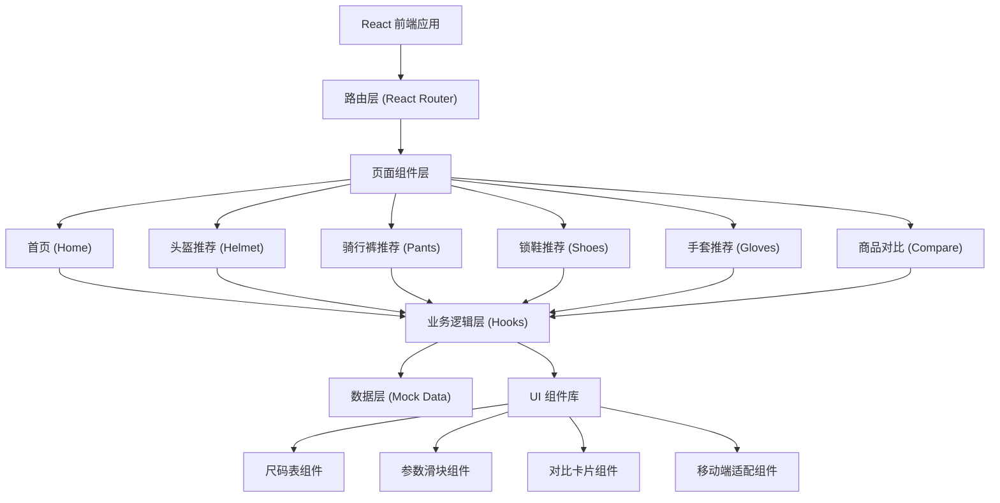

## 1. 架构设计



## 2. 技术描述

- **前端框架**：React@18 + TypeScript
- **构建工具**：Vite@5
- **样式方案**：TailwindCSS@3
- **路由管理**：React Router DOM@6
- **图标库**：Lucide React
- **动画库**：Framer Motion
- **数据来源**：内置 Mock 数据，无需后端
- **初始化方式**：`npm create vite@latest . -- --template react-ts`

## 3. 路由定义

| 路由 | 页面组件 | 用途 |
|------|----------|------|
| `/` | HomePage | 首页，装备分类入口导航 |
| `/helmet` | HelmetPage | 头盔尺码推荐页面 |
| `/pants` | PantsPage | 骑行裤尺码推荐页面 |
| `/shoes` | ShoesPage | 锁鞋尺码推荐页面 |
| `/gloves` | GlovesPage | 手套尺码推荐页面 |
| `/compare` | ComparePage | 商品参数对比页面 |

## 4. 数据模型

### 4.1 装备尺码数据定义

```typescript
// 头盔尺码
interface HelmetSize {
  size: string; // S, M, L, XL
  headCircumference: [number, number]; // [最小值, 最大值] 单位: cm
  brand: string;
}

// 骑行裤尺码
interface PantsSize {
  size: string;
  waist: [number, number]; // 单位: cm
  hip: [number, number]; // 单位: cm
  height: [number, number]; // 单位: cm
  weight: [number, number]; // 单位: kg
  fitType: 'racing' | 'endurance' | 'casual'; // 竞速/长途/休闲
}

// 锁鞋尺码
interface ShoesSize {
  size: string;
  euSize: number;
  footLength: [number, number]; // 单位: mm
  footWidth: [number, number]; // 单位: mm
  wideVersion: boolean; // 是否宽版
}

// 手套尺码
interface GlovesSize {
  size: string;
  handLength: [number, number]; // 单位: cm
  handCircumference: [number, number]; // 单位: cm
  padding: 'light' | 'medium' | 'thick'; // 衬垫厚度
}

// 商品数据
interface Product {
  id: string;
  name: string;
  category: 'helmet' | 'pants' | 'shoes' | 'gloves';
  brand: string;
  price: number;
  weight: number; // 单位: g
  breathability: number; // 1-10
  seasons: ('spring' | 'summer' | 'autumn' | 'winter')[];
  image: string;
  sizes: string[]; // 可用尺码
}
```

### 4.2 Mock 数据结构

- 头盔数据：包含 Giro、Specialized、MET 等品牌尺码
- 骑行裤数据：包含 Castelli、Assos、Rapha 等品牌
- 锁鞋数据：包含 Shimano、Sidi、Fizik 等品牌
- 手套数据：包含 Pearl Izumi、Craft、Giro 等品牌
- 商品数据：每类至少 6 款商品，覆盖不同价位和特性

## 5. 核心模块设计

### 5.1 尺码推荐 Hook

```typescript
// useSizeRecommendation.ts
function useHelmetRecommendation(headCircumference: number): RecommendationResult;
function usePantsRecommendation(waist: number, hip: number, height: number, weight: number, fitType: string): RecommendationResult;
function useShoesRecommendation(footLength: number, footWidth: number, needWide: boolean): RecommendationResult;
function useGlovesRecommendation(handLength: number, handCircumference: number, padding: string): RecommendationResult;
```

### 5.2 移动端适配方案

- **参数表组件**：根据屏幕宽度自动切换布局模式
  - 桌面端：传统表格布局，多列并排
  - 移动端：卡片堆叠布局，每行一个参数项，label: value 形式
- **对比区域**：使用 `overflow-x: auto` 实现横向滚动
  - 滚动容器隐藏滚动条，保留触摸滑动功能
  - 添加左/右渐变遮罩提示可滑动
- **输入控件**：使用 `@media (hover: none)` 针对触摸设备优化
  - 滑块加大触控区域（min-height: 44px）
  - 按钮最小尺寸 44x44px

### 5.3 动画效果

- 页面进入：使用 Framer Motion 的 `AnimatePresence`
- 滑块交互：`onChange` 时数字更新使用 spring 动画
- 推荐结果：`scale` + `opacity` 组合动画
- 对比卡片：添加时 `x` 轴位移 + 淡入
